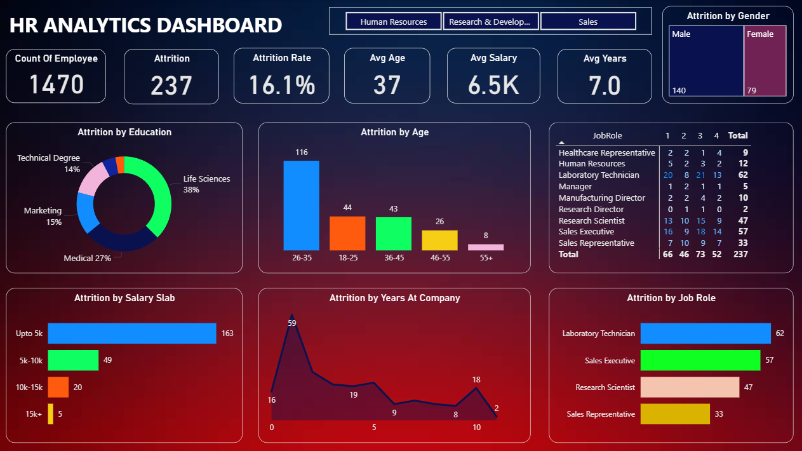

# HR Analytics Dashboard | Power BI

## Project Overview
This project analyzes employee data to identify patterns and factors contributing to employee attrition. The dashboard provides insights into workforce trends using interactive visualizations built in Microsoft Power BI.

## Key Highlights
- Total Employees: 1470
- Total Attrition: 237
- Attrition Rate: 16.1%

## Key Insights
- Highest attrition occurs in the 26–35 age group
- Laboratory Technicians and Sales Executives show the highest attrition
- Higher attrition among employees with salary up to 5K

## Tools & Technologies Used
- Microsoft Power BI
- Data Analysis
- Data Visualization

## Dashboard Preview
This dashboard helps visualize workforce trends and provides insights into employee attrition across different departments, age groups, and salary levels.

## Dataset
The dataset used in this project contains employee information including age, department, job role, salary, education field, and attrition status.
